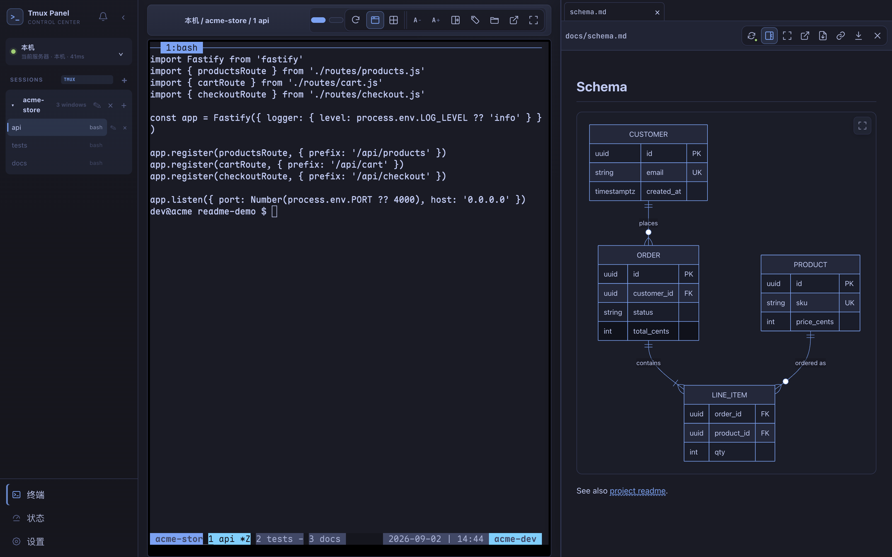
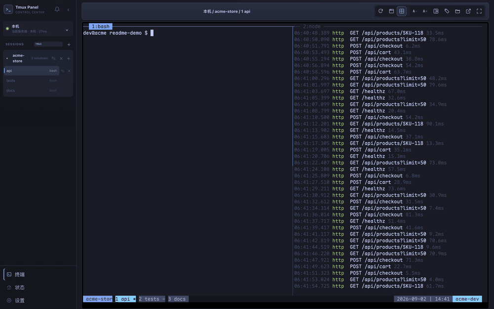
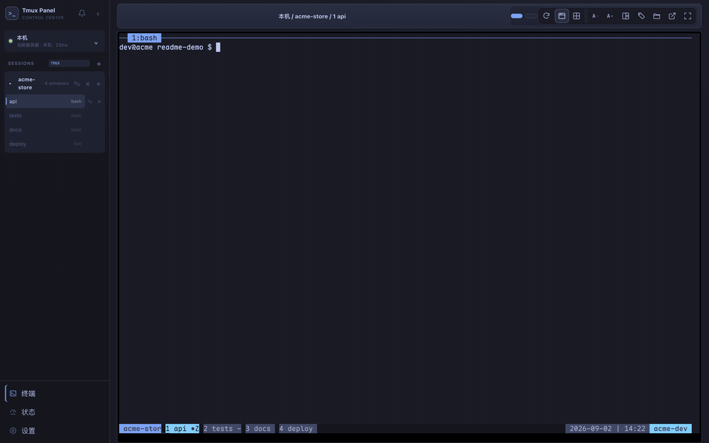
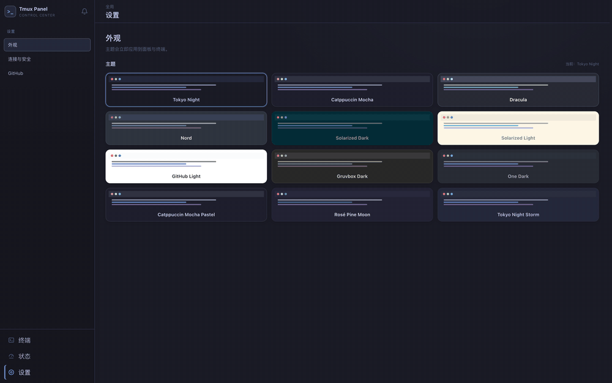
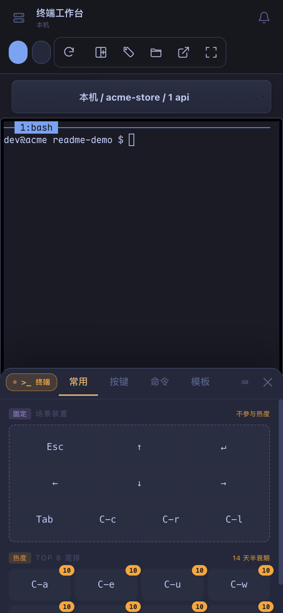
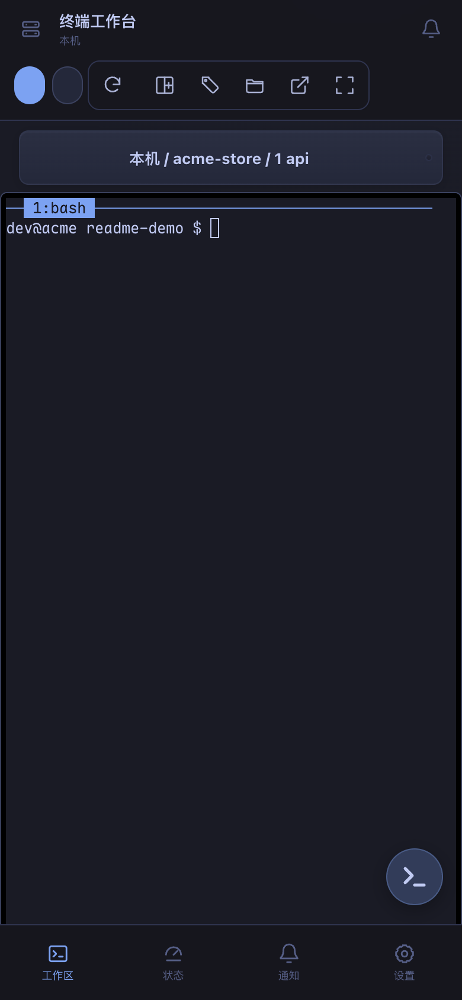
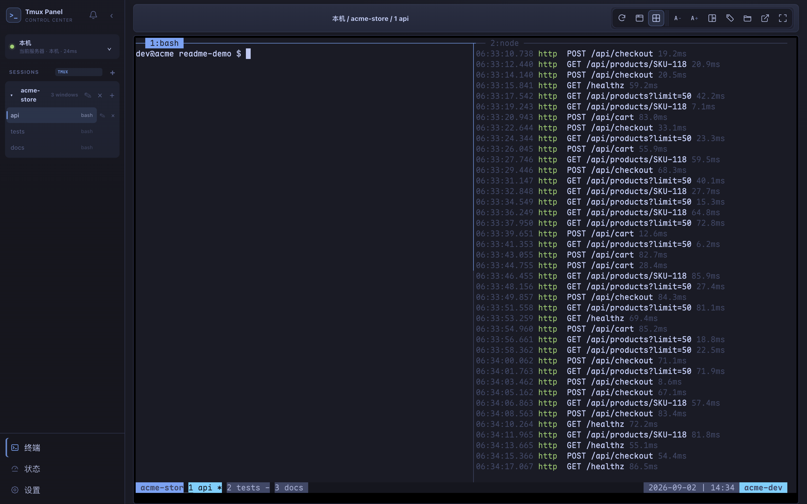
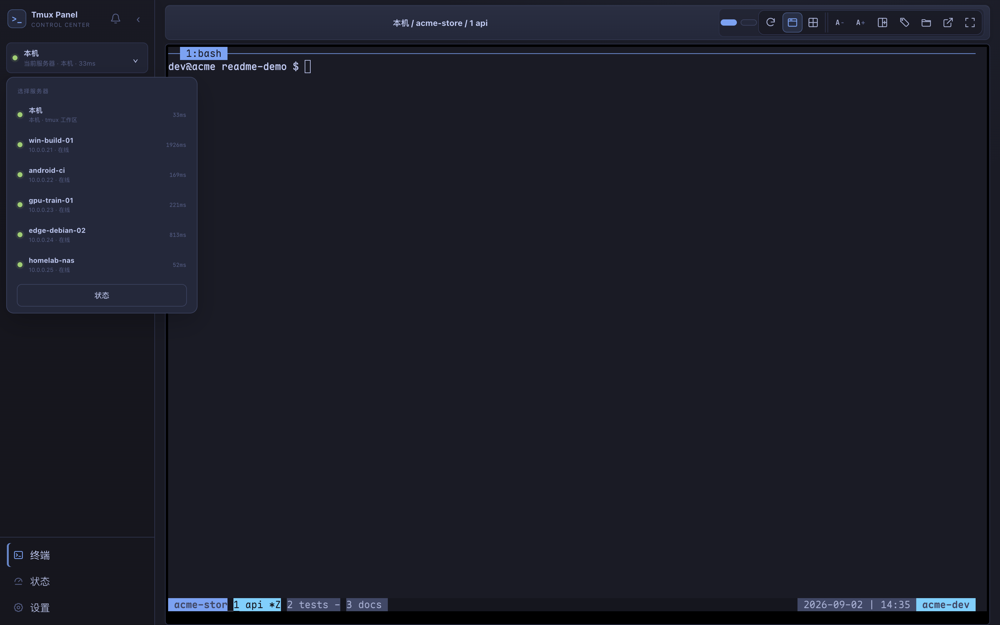
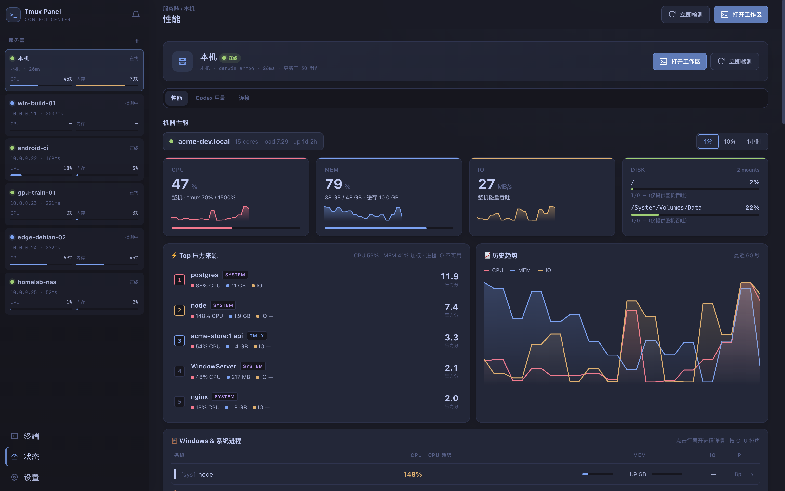
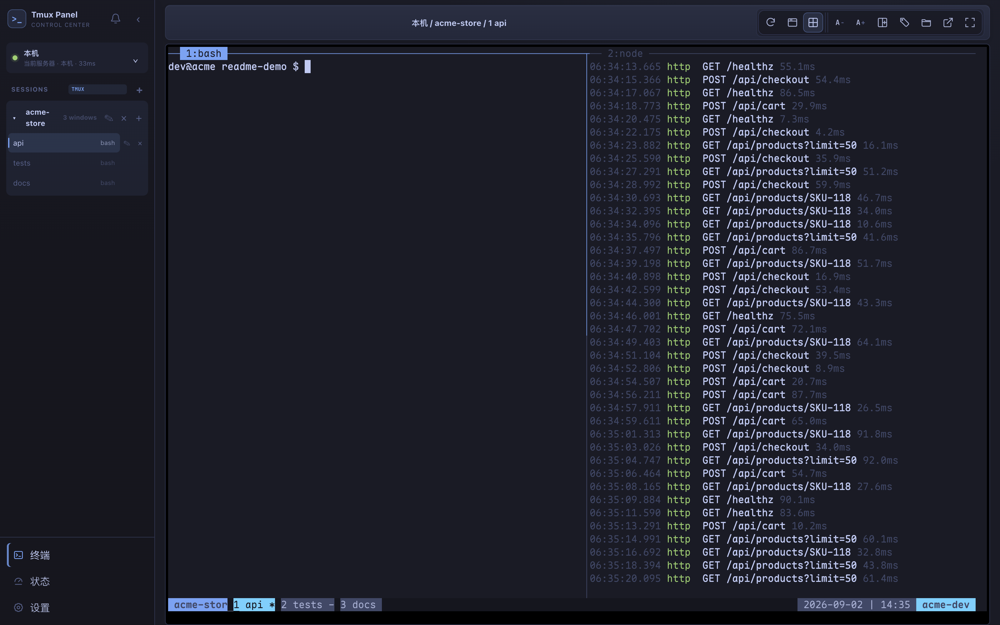

<div align="center">


[English](README.md) | 中文版

# Tmux Web Panel

**办公室 Mac 上跑着的 tmux，在沙发上的手机里接着用。**

浏览器里跑的是真 `tmux attach`，不是又套一层的终端模拟器。每台机器的每个
session、window、pane 都在，文档渲染、性能看板、还有追到手机上的
「构建跑完了」通知也都在。



</div>

---

## 先对几个场景，中了的继续往下翻

| 你的日常 | 面板接手之后 |
|---|---|
| 构建在办公室 Mac 上跑，你窝在沙发上只有一部手机。 | 手机浏览器里就是完整终端，能打字、能 Ctrl-C、能长按选字复制，滚动跟手。不用装 SSH 客户端，也不用找跳板机。 |
| 四个窗口各起了一个长任务，然后你就把它们忘了。 | 面板盯着每个窗口，命令一结束侧栏那一行开始呼吸，macOS 原生 App 还会推系统通知，点一下直接落到现场。 |
| Esc、Ctrl-C、↑、:wq，手机键盘一个都打不出来。 | 按键抽屉自己看当前 pane 跑的是 Claude Code、vim 还是 lazygit，递上对应那套键，外加你自己最常用的几个命令，按使用频率排。 |
| 堆栈里打印 api/routes/checkout.js:214，手机上只能截图放大眯眼看。 | 终端输出里的路径和 URL 都能点，代码、Markdown、Mermaid、CSV、PDF、压缩包目录树直接在终端旁边渲染出来。 |
| 笔记本、homelab 小主机、CI runner、GPU 箱子，还有那台 Windows，五个终端 App 加一堆记在脑子里的 SSH 配置。 | 一个工作台列全所有机器，健康状态、延迟、CPU 内存都在，任何视图细到单个 pane 都有能分享的 URL。 |
| 网页终端多半是个画布，TUI 一跑就花，窗口一拉就乱，scrollback 还会丢。 | 这边是 node-pty 上的真 attach 加 xterm 的 WebGL 渲染，zoom 和分屏两种模式，布局能拖，12 套主题，逐 pane 调字号，中文不乱码。 |

中两条以上的，继续。

---

## 看它动起来

| | |
|:---:|:---:|
|  |  |
| 你没盯着的那个窗口里任务结束了。侧栏那一行开始呼吸，铃铛记上数，点一下就到现场。 | 按 ⌘K 模糊搜，任何机器上的任何窗口都能直接跳。 |
|  |  |
| 12 套主题，点一下，UI 和终端一起换。 | 手机上的按键抽屉，场景页签、方向键盘、按使用率排出来的 Top 8。 |

---

## 一天里它插得上手的几个时刻

### 23:40 在沙发上启动迁移

终端不是只读日志查看器，它是 attach 着的 tmux，能打字、能 Ctrl-C、能改大小、能分屏。手机上缺的键由按键抽屉补，pane 从 shell 切到 Claude 再切到 vim 的时候，抽屉的布局自己跟着换。

说真的，手机终端类产品做过的人都知道，难的不是把字符画出来，是输入。软键盘和工具盘抢焦点、iOS 不认非手势触发的 focus、中文输入法把按键发两遍，这些坑这里都填过了。

 

### 09:15 早上不用先开电脑

完成检测盯的是每个 pane 从非 shell 回到 shell 的那一下跳变，所以普通脚本零配置就有通知。Claude Code 这类交互式 TUI 装一个 bell hook 就行。通知会落盘，重启不丢，用原生 App 的时候进 macOS 通知中心。

回到通知这块，还有一个细节值得说，侧栏那行呼吸是跟着你走的，切到那个窗口就停，不会一直闪到你烦。

### 11:30 读文档不用切窗口

点一下工具刚打印出来的路径。Markdown 带 KaTeX 公式、Obsidian 的 callout 和能点的 wikilink，Mermaid 按当前主题渲染还能导出 PNG，zip 直接摊开目录树。看完把它停靠在右边继续干活，标签按窗口记着，下次打开还在。



### 14:00 一个标签页管所有机器

登记一台主机之后，面板走你现有的 OpenSSH 那一套，config、agent、ProxyJump、硬件密钥都认，远端不装任何东西，也不存任何密钥。没有 tmux 的机器也能用，面板自己用持久 SSH PTY 托管一套 session 树，只是会明确告诉你这条路的持久性弱一些。

其实吧，多机器管理做到后面拼的不是功能列表，是地址栏。这里任何视图细到单个 pane 都是一个 URL，能收藏能分享能贴给同事，很多团队会遇到的「我屏幕上这个画面你怎么看到」的问题就不存在了。



状态页是个小观测台。每台机器的 CPU、内存、IO 带历史曲线，真正在施压的进程排前面，按 tmux 窗口聚合的资源占用也能展开。在跑 AI 工具的那台机器上还有 Claude 和 Codex 的实时用量窗口和重置倒计时，可以确定的是，比自己去翻 JSON 快。



### 16:20 把它调成自己的

布局选择器里直接拖 pane 边框，常驻的窗口 pin 住，任何一行右键都有上下文操作，主题挑一套和你其他工具相配的。怎么说呢，这类调整做一次就不想再碰，所以偏好全都记着，换设备也是同一套。



---

## 说到底它是什么

一句话版本，一个跑在你自己机器上的 tmux 控制台，Web 前端零构建，后端是 Express 加 ws 加 node-pty，终端渲染用 xterm.js 6 的 WebGL。

展开一点说。终端这条线做的是真 attach，zoom 和分屏两种模式，布局预设加拖拽改大小，重连带退避，而且分得清「会话被别人接走」和「网络断了」这两种完全不同的情况，提示语也不一样。输入这条线在手机上做得最重，场景感知按键抽屉的按键按使用率排序，首次运行会从你自己的 shell 历史、slash commands、vim 映射里种子化，长按选字带一个可编辑的复制预览，还能从手机往主机传文件。

链接识别这条线坦率的讲是用了之后回不去的那种，路径、file://、localhost 带端口、:line 引用、中文文件名全都可点，预览覆盖代码、Markdown 加 Obsidian 语法、Mermaid、图片、PDF、CSV 和 XLSX、目录、压缩包，文件一变自动刷新，渲染结果还能生成带过期时间的分享快照。多机这条线有 8 种显式健康状态，主机密钥首次信任要给指纹确认，远端指标用只读探针采集，不在远端装 agent。

运维侧也没裸着。可选的 token 认证，可选的自签 TLS 覆盖 localhost 加局域网 IP，systemd 和 launchd 安装器从 pinned 子模块构建 tmux，重启后会话恢复有伴随服务兜底。重启丢会话这个坑大家也都知道，安装器把 tmux-resurrect 和 continuum 的接线一起做了。

测试大概 1,400 个，前端、后端、SSH 传输、原生桥都覆盖。不在一个尺度上谈不上，但至少不是没测试的周末项目。

---

## 快速开始

```bash
npm install
node server/index.js
```

打开 http://localhost:7681 就能用，没有构建步骤，没有数据库。

想让它登录自启、崩了自己爬起来，跑安装器。加 TLS_AUTO=1 顺带把局域网 HTTPS 也开了，证书会自动覆盖 localhost 和当前局域网 IP。

```bash
git submodule update --init --recursive
TLS_AUTO=1 ./scripts/install-service.sh install
```

Qoder、Codex 这类 AI Agent 可以把停止、等待交互、失败、会话结束事件直接打进同一套通知流。

```bash
node scripts/install-agent-hooks.js all
```

macOS 上还有个原生 SwiftUI 外壳，npm run build:macos 构建，多菜单栏状态、原生通知和真正的剪贴板桥。WKWebView 拦异步剪贴板这件事，踩过坑的都懂。

---

## 想再深入

| | |
|---|---|
| [配置与认证](docs/authentication.md) | flag、环境变量、token 模型、登出 |
| [Agent 自动提示](docs/agent-notifications.md) | Qoder/Codex hook 安装、token 处理、去重规则 |
| [服务安装与重启后会话恢复](docs/service-install.md) | systemd 和 launchd、TLS、vendored tmux、tmux-resurrect 接线 |
| [文件预览与链接识别](docs/file-preview.md) | 停靠标签、渲染器、分享、敏感路径策略 |
| [移动端交互指南](docs/mobile-gestures.md) | 选择手势、滚动、按键抽屉、上传 |
| [多服务器设计](docs/多服务器管理-UIUX设计.md) | 工作台背后的 UX 模型，附可点击 demo |
| [多服务器实现](docs/多服务器管理-前后端实现文档.md) | provider、SSH 传输、API 和 WS 契约、安全边界 |
| [macOS 原生 App](macos/README.md) | Swift 外壳加了什么、怎么构建 |
| [已知问题与修复清单](docs/known-issues.md) | 我们已经知道哪里还糙 |

## 开发

```bash
npm test          # vitest，前端后端 SSH 传输原生桥都跑
npm run dev       # 起服务
```
