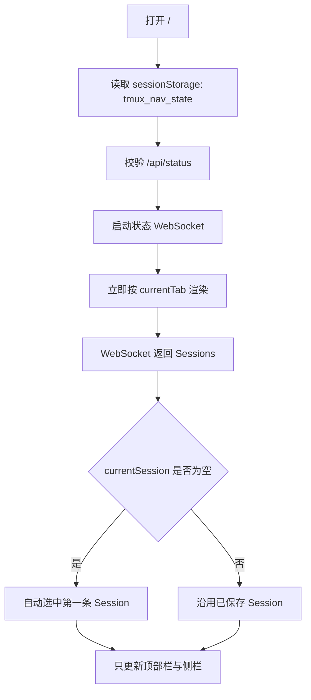

# Tmux Web Panel 多服务器入口与 UI/UX 重构设计

> [!example] 可点击 Demo
> [打开多服务器 UI Demo](demos/multi-server-ui-demo.html)，可体验工作台、服务器列表、服务器概览、性能、tmux、连接以及移动端布局。

> [!summary] 核心结论
> 当前问题不是“缺少一个服务器下拉框”，而是应用没有统一的导航模型：页面、当前会话、当前窗口和当前 Pane 混在一个全局可变状态里，桌面端与移动端又提供了语义不同的入口。
>
> 本次应先重构应用外壳和路由，再接入多服务器。目标结构是：**全局工作台 → 服务器 → 服务器工作区 → 可选能力（概览、性能、tmux、连接）**。tmux 是服务器能力之一，不是注册服务器的前置条件。

## 1. 文档范围

本文先解决 UI/UX、信息架构、入口和前端状态边界，不决定 SSH 库、凭证存储或远程采集实现。

本轮分析基于：

- `public/index.html` 的应用外壳和脚本加载顺序。
- `public/js/app.js` 的启动、导航、状态恢复、桌面首页和侧栏逻辑。
- `sessions.js`、`windows.js`、`terminal.js`、`notifications.js`、`command-palette.js` 的二级入口。
- `public/css/style.css` 的桌面/移动端分支。
- 正在运行的本地服务返回的实时 Session、Window 和性能数据。

本地服务可访问，但真实 Chrome 对自签名 HTTPS 证书的处理导致样式资源未能可靠加载，因此本轮对运行界面的验证以 DOM、状态和源码为主；不把浏览器中的无样式页面作为视觉验收依据。

## 2. 当前入口逻辑还原

### 2.1 启动链路



关键事实：

- 默认状态是 `currentTab = windows`，但并不存在真正的 URL 路由（`public/js/app.js:270-367`）。
- 导航恢复只存在当前浏览器标签页的 `sessionStorage` 中，刷新可以恢复，但复制链接、前进/后退、跨标签页都无法表达当前位置（`public/js/app.js:299-320`）。
- 源码注释称其为“hash-based router”，实际没有读取或写入 hash，也没有 `popstate`/`hashchange` 处理（`public/js/app.js:323-367`）。
- WebSocket 首次返回状态后，如果未选择 Session，会直接选择数组第一项（`public/js/app.js:1793-1796`）。这不是用户选择，也不是稳定的产品入口。

### 2.2 当前页面映射

| `currentTab` | 桌面端 | 移动端 | 返回行为 |
|---|---|---|---|
| `sessions` | 与 `windows` 一样，渲染桌面首页 | Session 卡片代码存在，但主路由实际渲染 Window 列表 | 不稳定 |
| `windows` | 首页：统计、最近访问、性能面板 | 当前 Session 的 Window 卡片 | 终端返回这里 |
| `terminal` | 终端 + 左侧 Session 树 | 隐藏全局顶部栏，进入沉浸终端 | 自定义返回 Window |
| `more` | 设置、状态、主题、性能入口混合页 | 同一页面 | 再点设置回到 `windows` |
| `perf` | 独立性能页 | 独立性能页 | 固定返回 `more` |
| `notifications` | 实际通常使用浮层 | 移动端整页式内容 | 固定返回 `windows` |

`sessions` 与 `windows` 在桌面端被合并，在移动端又不是同一种信息结构（`public/js/app.js:386-403`）。这意味着同一个状态值在不同设备上代表不同页面。

### 2.3 当前实际存在的入口

应用目前至少有六套彼此平行的入口：

1. 桌面侧栏 Session/Window 树。
2. 移动顶部栏 Session 下拉框。
3. 桌面首页的最近访问。
4. `⌘K` 命令面板，直接搜索 Session/Window 并进入终端。
5. 通知浮层或移动通知页，直接进入 Window。
6. 终端内部返回按钮、Pane pills、布局和文件预览入口。

这些入口最终都直接改写 `state.currentSession/currentWindow/currentPane/currentTab`，但没有共同的路由对象，也没有统一的“进入目标前校验”过程。

## 3. 现有体验的结构性问题

### P0：导航状态不可寻址

用户无法通过 URL 表达“哪台服务器、哪个 Session、哪个 Window、哪个 Pane”。因此浏览器后退不是应用后退，无法复制深链接，未来加入 `serverId` 后也更容易把动作发到错误服务器。

### P0：响应式改变了页面语义

桌面端的 `windows` 是综合首页，移动端的 `windows` 是 Window 列表；桌面端侧栏承担导航，移动端顶部 Session 下拉承担导航；进入终端后移动端又隐藏全局入口。响应式应该只改变布局，不应改变路由含义。

### P1：首次首页存在数据时序错误

桌面首页在 WebSocket 返回前渲染，统计值会先显示 `0 SESS / 0 WIN / 0 PANE`；状态到达后只更新顶部栏和侧栏，没有重新渲染首页统计。运行中的页面已观察到顶部显示 `4s · 23w`，首页仍显示三个 `0`。

这说明页面数据和应用导航状态缺少统一的订阅/失效机制。

### P1：桌面与移动重复实现同一操作

通知、新建 Window、全屏、设置同时存在于 `index.html` 顶部栏和 `app.js` 动态生成的桌面侧栏头部；事件绑定也分成两套（`public/index.html:21-35`、`public/js/app.js:867-1044`、`public/js/app.js:1959-2004`）。

### P1：“More” 成为杂物抽屉

服务器连接状态、Session/Window 数量、机器 IP、性能入口、主题、关于和退出登录被放在同一页面。性能既出现在桌面首页，又作为 More 的二级入口，再通过专用返回按钮回到 More（`public/js/app.js:541-705`）。

### P1：`+` 的作用域不清楚

当前顶部/侧栏 `+` 表示“在当前 Session 新建 Window”，首页同时又有“新建 Session”和“新建 Window”。加入服务器后，若继续使用无标签的通用 `+`，用户无法预判它会创建服务器、Session 还是 Window。

### P1：Session 同时承担选择器和资源树

点击 Session 既可能切换当前 Session，也可能展开/收起；在桌面首页又不会进入明确的 Session 页面。当前选中、展开状态和工作区内容不是三个独立概念。

### P2：渲染和样式边界已失控

- `app.js` 约 2,079 行，同时包含 API client、全局状态、路由、首页、More、侧栏、通知协调和启动逻辑。
- `style.css` 约 5,564 行；`#sidebar`、`#topbar`、桌面/移动媒体查询在文件中多次重复声明，后部覆盖前部。
- 侧栏主要通过拼接 HTML、替换 `innerHTML`、清缓存键和重新绑定事件更新。
- 现有 UI 测试主要验证源码字符串和 CSS token 是否存在，没有覆盖真实导航状态机。

本次不需要引入 React/Vue；需要的是明确边界，而不是新框架。

## 4. 新的产品心智模型

### 4.1 两个层级

```text
全局层
├── 工作台
├── 服务器
├── 通知（工具入口，不是主导航页）
└── 设置

服务器工作区
├── 概览
├── 性能
├── tmux（能力可用时显示）
└── 连接
```

核心变化：

- “服务器列表”是一级入口，不藏在 Session 下拉框中。
- 选择服务器后进入该服务器的工作区，而不是立刻假设它拥有 tmux Session。
- `tmux` 是服务器能力之一。没有安装 tmux 的服务器仍可注册、测活和查看性能。
- 性能属于服务器工作区；工作台只展示跨服务器摘要和异常，不复制完整性能面板。

### 4.2 能力模型

```text
server.capabilities
├── reachability
├── ssh
├── metrics
├── tmux
└── processDrilldown
```

UI 规则：

- `tmux = unavailable`：不显示 Session 树；详情中说明“未检测到 tmux”，但不阻塞其他功能。
- `metrics = partial`：显示可用指标，不支持项显示 `—` 和原因。
- `ssh = auth_failed`：服务器仍保留在列表中，主动作变为“修复认证”。
- `reachability = offline`：保留最后一次成功数据并标注时间，不清空为零。

## 5. 推荐入口设计

### 5.1 默认入口：全局工作台

打开应用默认进入工作台，而不是自动选择第一条 Session。工作台只回答四个问题：

1. 哪些服务器需要处理？
2. 最近使用了哪些终端？
3. 全部服务器是否在线？
4. 下一步最常见动作是什么？

推荐内容：状态摘要、最多 5 条需处理服务器、最近终端和明确的“添加服务器”按钮。不在工作台展示完整进程排行、所有磁盘挂载和长趋势图。

### 5.2 一级入口：服务器

服务器页是注册表和总览：

- 搜索和状态筛选。
- 服务器名称、状态、地址、延迟、CPU、内存、tmux 能力、更新时间。
- 行主动作是“进入服务器工作区”。
- 行内次动作是“立即检测”；编辑和删除放入更多菜单。

### 5.3 服务器工作区入口

点击服务器后默认进入“概览”，而不是 tmux：

```text
服务器身份区
名称 · 状态 · Host · 最后检测 · [立即检测] [编辑]

[概览] [性能] [tmux] [连接]
```

如果服务器支持 tmux，用户从“最近终端”或 Session 树进入时可以直接深链到终端，无需绕过概览。

### 5.4 桌面端应用外壳

桌面端保持单侧栏，不增加永久第二侧栏：

```text
┌────────────── 248px ──────────────┬───────────────────────────────┐
│ Tmux Panel                 [通知] │ 工作台 / 服务器 / 当前上下文   │
│                                   │                               │
│ ▣ 工作台                          │                               │
│ ◉ 服务器                     8    │          主内容区              │
│                                   │                               │
│ 当前服务器                        │                               │
│ [● build-mac                ▾]    │                               │
│   概览                            │                               │
│   性能                            │                               │
│   tmux                            │                               │
│     ▾ DataAnt                     │                               │
│       1 三绿                      │                               │
│       2 风控点总结                │                               │
│   连接                            │                               │
│                                   │                               │
│ 设置                              │                               │
└───────────────────────────────────┴───────────────────────────────┘
```

设计约束：

- 单侧栏始终只存在一个组件和一套事件处理。
- 只有进入 `tmux` 区域时才展开 Session/Window 树。
- 收起侧栏后保留一级入口图标和当前服务器状态，不只剩一个状态点。
- 终端全屏仍可隐藏应用外壳；退出后回到同一深链。

### 5.5 移动端应用外壳

非终端页面使用底部一级导航：

```text
[工作台] [服务器] [通知] [设置]
```

顶部栏只承载当前页面标题、服务器上下文和页面动作，不再同时承担全局导航。

进入服务器工作区后：

- 顶部显示返回、服务器状态和名称。
- 概览/性能/tmux/连接使用可横向滚动的分段标签。
- Session/Window 使用列表或卡片，不复制桌面树。
- 终端继续使用沉浸模式，但返回按钮回到准确的 Window 路由。

## 6. 动作入口规范

取消无文案的通用 `+` 作为核心业务入口。主按钮必须说明对象和作用域：

| 当前页面 | 主动作 | 目标作用域 |
|---|---|---|
| 工作台 | 添加服务器 | 全局 |
| 服务器列表 | 添加服务器 | 全局 |
| 服务器概览 | 立即检测 | 当前服务器 |
| tmux 首页 | 新建 Session | 当前服务器 |
| Session | 新建 Window | 当前服务器 + 当前 Session |
| Terminal | 新建 Pane | 当前服务器 + 当前 Window |

所有创建、删除和移动弹窗的标题都必须带目标，例如：

- “在 **build-mac / DataAnt** 中新建 Window”
- “将 **build-mac / DataAnt / 2** 移动到 **local / Tools**”

## 7. 统一路由与前端状态

### 7.1 路由格式

现有 Express 只提供静态文件，没有 SPA fallback。第一阶段使用真正的 hash 路由，无需新增依赖或改服务器路由：

```text
/#/home
/#/servers
/#/servers/new
/#/server/local/overview
/#/server/local/performance
/#/server/local/tmux
/#/server/local/tmux/DataAnt/window/@5/pane/%2512
/#/server/local/connection
/#/settings
```

服务器、Session、Window、Pane 进入 URL 后：

- 刷新、前进/后退和复制链接语义一致。
- `serverId` 使用稳定 ID；名称变化不破坏链接。
- Window 优先使用稳定 tmux window ID，不继续把易变化的 index 作为长期身份。

### 7.2 状态拆分

```js
route = {
  area: 'home' | 'servers' | 'server' | 'settings',
  serverId: null,
  section: null,
  sessionName: null,
  windowId: null,
  paneId: null,
}

ui = {
  sidebarCollapsed: false,
  openOverlay: null,
  terminalMode: 'tab',
}

data = {
  servers: [],
  serverStatusById: {},
  tmuxByServerId: {},
  metricsByServerId: {},
}
```

规则：

- 路由只表达“用户在哪”，不存实时性能值。
- UI 临时状态不决定业务目标。
- API 调用从路由快照解析明确 scope，不直接读取随时可能变化的全局 `currentSession`。
- 服务器切换时先完成目标路由更新，再开始加载数据；旧请求返回后必须因 scope 不匹配而丢弃。

### 7.3 启动优先级

```text
有效 URL 深链
  > 当前浏览器最近有效路由
  > /#/home
```

不再把“服务器数组第一项”或“Session 数组第一项”设为全局入口。只有用户明确进入某服务器的 tmux 页面且未指定 Session 时，才可以在该局部页面选择默认项。

## 8. 服务器切换行为

1. 用户在服务器选择器中选择目标。
2. URL 先更新到目标服务器概览，页面标题立即显示目标名称。
3. 当前工作区显示局部骨架；旧服务器数据不冒充新服务器数据。
4. 获取能力和状态。
5. 根据能力显示概览、性能、tmux 和连接标签。
6. 若用户是从“最近终端”进入，则校验深链中的 Session/Window；不存在时回退到该服务器的 tmux 首页并说明原因。

不采用“尝试恢复同名 Session/Window”作为默认切换行为。同名不代表同一对象，跨服务器自动匹配容易误操作。

## 9. 通知、搜索和设置的归位

### 通知

- 通知是全局工具入口，不是 `currentTab`。
- 每条通知必须携带 `serverId`、对象 ID 和时间。
- 点击通知通过统一 router 进入目标。
- 桌面显示抽屉，移动显示全屏层；两者是同一通知模型。

### 搜索 / 命令面板

- `⌘K` 扩展为统一搜索：服务器、Session、Window 和页面动作。
- 结果必须显示服务器名，避免同名 Session 混淆。
- 选择结果只调用 `router.navigate(route)`，不自行拼 API 和修改全局字段。

### 设置

设置页只保留主题、偏好、认证引用、关于和退出。机器状态和性能从 More 中移出；More 本身取消。

## 10. 状态与错误设计

| 状态 | 含义 | 主要动作 |
|---|---|---|
| 在线 | 最近测活成功 | 打开 |
| 需关注 | 可连接，但指标越线或部分能力失败 | 查看原因 |
| 离线 | 网络/握手连续失败 | 立即检测 |
| 认证失败 | 网络可达，SSH 认证失败 | 编辑认证 |
| 指纹变化 | 主机指纹与记录不一致 | 核对指纹 |
| 数据过期 | 最后样本超过刷新周期 | 刷新 |
| 未检测 | 没有测活结果 | 开始检测 |
| 已停用 | 用户暂停检测 | 启用 |

统一规则：

- 不用颜色作为唯一编码。
- `0` 只表示真实采样为零；未知、不支持、失败都显示 `—`。
- 离线时保留最后成功样本和绝对时间。
- 错误必须指出失败层：TCP、SSH 握手、认证、指纹、指标或 tmux。

## 11. 前端代码重构边界

保持 Vanilla JS，不引入前端框架。先拆职责，再改视觉：

```text
public/js/
├── router.js          # hash 解析、校验、前进后退
├── app-store.js       # route/ui/data，订阅与失效
├── app-shell.js       # 唯一的桌面/移动外壳
├── servers.js         # 列表、详情、注册
├── sessions.js        # 仅 tmux Session 页面
├── windows.js         # 仅 Window 页面
└── terminal.js        # 保留终端职责
```

CSS 第一阶段不做全面重写，只建立明确层级并停止尾部覆盖：

```text
tokens → shell/layout → components → pages → responsive
```

必须先增加行为测试：

- URL 与 route 双向转换。
- 浏览器后退/前进。
- 无效 server/session/window 的回退。
- 桌面和移动端相同 route 渲染相同页面语义。
- 服务器切换期间旧请求不能污染新 scope。
- 通知和 `⌘K` 使用统一路由。

## 12. 分阶段实施方案

### Phase 0：冻结现有行为

- 为启动、恢复、桌面/移动路由和终端返回补 characterization tests。
- 记录现有 API，不改 tmux 业务行为。

### Phase 1：统一路由和应用外壳

- 引入 `route/ui/data` 三类状态。
- 实现 hash router 和浏览器历史。
- 只保留一套应用外壳、一套通知入口和一套动作分发。
- 把现有本机映射为固定 `serverId = local`。

完成此阶段后，外观可以仍接近现在，但入口逻辑必须已经统一。

### Phase 2：先做多服务器 UI

- 服务器列表、服务器详情、空状态、加载和错误状态。
- 使用本地静态/模拟数据完成桌面与移动 UX 验证。
- tmux 能力开关决定相关入口是否出现。

### Phase 3：接入服务器注册和测活

- 注册流程、认证引用、主机指纹确认。
- TCP、SSH、认证、指标、tmux 分层状态。
- 本机和远程服务器共用同一 UI 数据协议。

### Phase 4：给现有 tmux/性能 API 增加 server scope

- 现有 `/api/sessions` 先通过 local provider 兼容。
- 再增加远程 provider；没有 tmux 时返回 capability unavailable，而不是空 Session 冒充正常。
- 性能面板按 `serverId` 隔离缓存、历史和轮询。

### Phase 5：删除旧入口

- 删除 `currentTab/currentSession/currentWindow/currentPane` 直写路径。
- 删除 `more` 页面、重复顶部栏和重复事件绑定。
- 收敛 CSS 重复规则和只验证源码字符串的 UI 测试。

## 13. UI/UX 验收标准

- [ ] 打开应用默认进入工作台，不自动把第一条 Session 当作用户选择。
- [ ] 同一 URL 在桌面和移动端表达同一页面，只改变布局。
- [ ] 浏览器刷新、前进、后退和复制深链接均能恢复服务器上下文。
- [ ] 服务器未安装 tmux 时仍可注册、测活和查看支持的性能数据。
- [ ] 用户能在两次点击内从工作台进入任意最近终端。
- [ ] 所有创建/删除/移动动作明确显示服务器和对象作用域。
- [ ] 切换服务器时旧请求不会更新新服务器页面。
- [ ] 通知和 `⌘K` 不直接修改业务全局变量，只走统一路由。
- [ ] 性能、设置、通知不再混在 More 页面。
- [ ] 360px 宽度下可完成服务器选择、测活和进入终端。
- [ ] 桌面端不增加永久第二侧栏，终端宽度不被额外侵占。
- [ ] 在线、离线、认证失败、指纹变化、数据过期可由文字和图标区分。

## 14. 本次设计决策

> [!decision] 入口决策
> “服务器列表”是一级入口；“服务器选择器”只是进入已知服务器的快捷方式，不能替代注册表和总览。

> [!decision] tmux 决策
> tmux 是可选 capability。服务器工作区始终可以有概览和连接；性能和 tmux 根据能力出现。

> [!decision] 技术决策
> 使用原生 hash、History API 和现有 Vanilla JS 完成第一阶段，不为了重构入口引入新框架。

> [!decision] 迁移决策
> 先统一路由和外壳，再做多服务器 UI，最后接远程连接。不要把 `serverId` 直接塞进当前四个全局字段后继续扩建。
