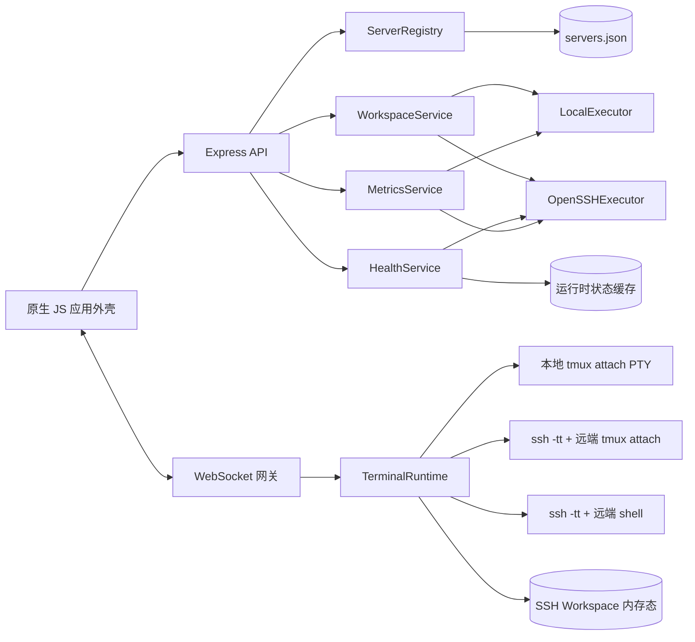
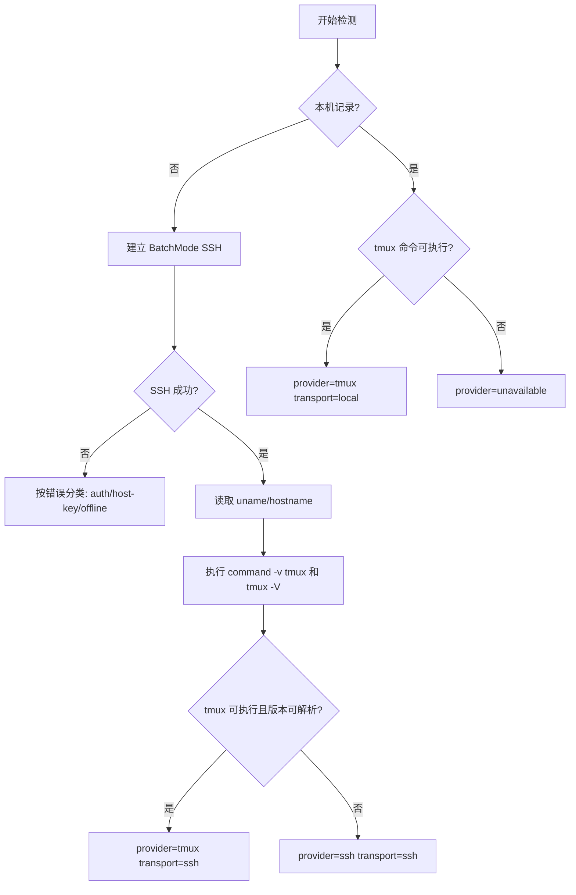
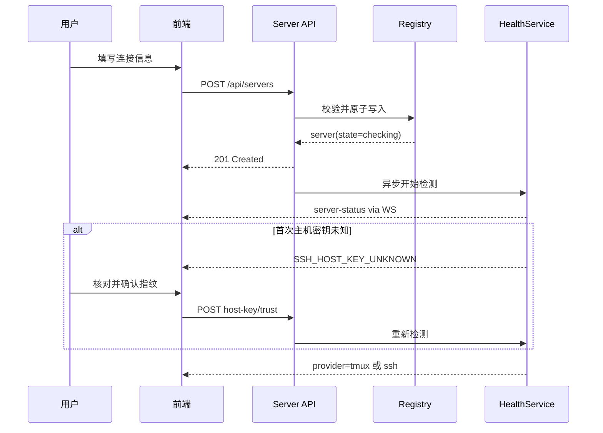
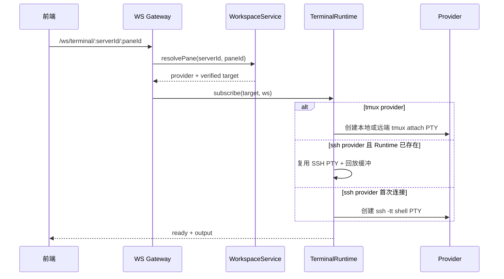

# Tmux Web Panel 多服务器管理前后端实现文档

> [!summary] 已确定的产品边界
> 系统**不负责在远端安装、升级或启动 tmux**。注册服务器后只做只读能力检测：远端 tmux 可用时接入真实 tmux；tmux 不可用但 SSH 可用时，由面板创建并管理 SSH Session，以统一的 Session / Window / Pane 结构呈现；SSH 不可用时进入连接修复状态。

> [!example] 交互基准
> UI 以 [多服务器 UI Demo](demos/multi-server-ui-demo.html) 为准。本文负责把 Demo 中的结构映射为现有项目可执行的前端模块、后端服务、API、WebSocket 协议和迁移步骤。

> [!success] 2026-08-31 实施状态
> 多服务器应用外壳、Hash 路由、服务器注册与状态、能力检测、性能指标、本机/远端 tmux 工作区、无 tmux 时的 SSH Session 回退、带 `serverId` 作用域的终端连接，以及终端右侧文件预览均已落地。终端、状态和设置使用同一应用外壳；离开终端页会卸载文件预览，返回时恢复当前终端上下文。
>
> WorkspaceAtlas 中已确认的 5 台 SSH 主机已写入本机服务器注册表，但面板不会自动接受未知 SSH 主机指纹，因此它们在人工完成信任前显示 `SSH_HOST_KEY_UNKNOWN`。当前实现已在 `7801` 演示实例验证，正式 `7681` 服务没有在本次收尾中重启或切换。

## 1. 文档目标

本文是可直接进入开发的实现依据，回答以下问题：

1. 如何在不推翻现有 Node/Express、原生 JS 和 xterm.js 的前提下支持多服务器。
2. 本机 tmux、远端 tmux 和纯 SSH 三种场景如何共用一套 UI。
3. 服务器注册、测活、能力检测、性能采集和终端连接如何分层。
4. 新 API、WebSocket、前端路由和状态模型如何定义。
5. 如何分阶段迁移，保证本机 tmux 的现有能力不回退。

本文替代《多服务器管理-UIUX设计》中“没有 tmux 就不展示 Session 树”的旧描述。最终规则是：**没有 tmux 时仍展示 SSH Session 树，但必须清楚标注 SSH 模式及其弱持久化语义。**

## 2. 现状基线

### 2.1 当前技术栈

| 层 | 当前实现 | 本次策略 |
|---|---|---|
| Web 服务 | Node.js ESM + Express 5 | 保留 |
| 实时通信 | `ws` | 保留，扩展消息作用域 |
| 终端 | xterm.js + `node-pty` | 保留，重构 PTY 所有权 |
| tmux 调用 | `execFile('tmux', args)` | 保留本地执行，增加远端执行器 |
| 前端 | 原生 JS + HTML/CSS | 保留，不引入 React/Vue |
| 状态 | `app.js` 全局对象 + `sessionStorage` | 拆为路由状态、资源状态、UI 状态 |
| 性能 | Node `os` + Darwin/Linux 采集器 | 保留本机采集，增加 SSH 只读采集 |
| 持久化 | `~/.config/tmux-web-panel/*.json` | 沿用，增加 `servers.json` 等文件 |

新增依赖保持为零：第一版统一调用系统 OpenSSH 客户端，不引入 SSH 协议库。这样可直接复用用户已有的 `~/.ssh/config`、SSH Agent、ProxyJump 和硬件密钥。

### 2.2 当前必须处理的技术债

- `public/js/app.js` 同时承担 API、导航、状态、侧栏、首页和启动流程。
- 当前所谓“路由”只修改内存状态，没有真实 hash 地址和浏览器前进/后退能力。
- 所有 API 默认指向本机 tmux，Session、Window、Pane ID 没有 `serverId` 作用域。
- `TerminalManager` 当前每个 WebSocket 创建一个 tmux attach PTY，WebSocket 断开就杀死 PTY；该模型不能承载可重连的 SSH Session。
- `StatusMonitor` 只轮询本机 tmux，通知键也是 `session:window`，多服务器下会冲突。
- `/api/system-stats`、性能历史、文件和进程能力都隐含“面板所在机器就是目标机器”。

## 3. 总体架构



架构只引入三个必要概念：

- `ServerRegistry`：管理服务器声明，不执行终端操作。
- `WorkspaceService`：屏蔽 tmux 与 SSH 的差异，输出统一树。
- `TerminalRuntime`：持有 PTY 生命周期，让 WebSocket 只负责订阅和输入输出。

不建立远端 Agent，不增加数据库，不做远端软件安装，也不把每个能力抽象成复杂插件系统。

## 4. 核心领域模型

### 4.1 Server

```js
{
  id: "api-linux",                  // 创建后不可变，URL-safe
  name: "API Linux",
  kind: "remote",                  // local | remote
  address: {
    host: "api.internal.example",
    port: 22,
    user: "deploy"
  },
  ssh: {
    configHost: null,               // 可选：直接使用 ~/.ssh/config 中的 Host
    identityFile: null,             // 只保存路径引用，不保存私钥内容
    proxyJump: null,
    knownHostAlias: null
  },
  enabled: true,
  createdAt: "2026-08-30T10:00:00.000Z",
  updatedAt: "2026-08-30T10:00:00.000Z"
}
```

内置本机服务器固定为：

```js
{
  id: "local",
  name: "本机",
  kind: "local",
  enabled: true,
  immutable: true
}
```

本机记录由程序合成，不写入 `servers.json`，不可删除，允许改显示别名但不允许改连接信息。

### 4.2 连接状态与能力

```js
{
  serverId: "api-linux",
  state: "online",                 // checking | online | degraded | offline | auth_required | host_key_error
  latencyMs: 42,
  checkedAt: "2026-08-30T10:01:00.000Z",
  lastOnlineAt: "2026-08-30T10:01:00.000Z",
  error: null,
  facts: {
    hostname: "api-01",
    platform: "linux",
    arch: "x64"
  },
  capabilities: {
    ssh: { available: true },
    tmux: { available: false, version: null, reason: "command_not_found" },
    metrics: { available: true, level: "basic" },
    files: { available: false }
  },
  workspace: {
    provider: "ssh",               // tmux | ssh | unavailable
    transport: "ssh",              // local | ssh
    persistence: "process-memory"  // tmux | process-memory | none
  }
}
```

不要用一个 `online: boolean` 压扁错误。`auth_required`、`host_key_error` 和真正离线的修复动作不同。

### 4.3 统一 Workspace 树

前端只消费统一模型，不直接判断远端命令：

```js
{
  serverId: "api-linux",
  provider: "ssh",
  persistence: "process-memory",
  sessions: [
    {
      id: "ses_01J...",
      name: "API 调试",
      active: true,
      windows: [
        {
          id: "win_01J...",
          index: 0,
          name: "logs",
          active: true,
          panes: [
            {
              id: "pane_01J...",
              name: "shell",
              command: "zsh",
              active: true,
              geometry: { x: 0, y: 0, width: 120, height: 34 }
            }
          ]
        }
      ]
    }
  ]
}
```

tmux Provider 将真实 tmux 数据映射到这个结构：

- Session ID 改为读取稳定的 `#{session_id}`，名称仍是 `#{session_name}`。
- Window ID 继续使用稳定的 `@N`，不使用可变 index 做破坏性操作。
- Pane ID 继续使用 `%N`。
- 对外 ID 始终与 `serverId` 一起使用；不得假设 `%1` 在全系统唯一。

SSH Provider 使用 `crypto.randomUUID()` 生成应用 ID。它们不是伪造的远端 tmux 对象，而是面板管理的工作区对象。

### 4.4 三种运行模式

| 场景 | transport | provider | Session/Window/Pane 来源 | 浏览器断开 | 面板服务重启 |
|---|---|---|---|---|---|
| 本机 tmux | local | tmux | 本机真实 tmux | 保留 | 保留 |
| 远端有 tmux | ssh | tmux | 远端真实 tmux | 保留 | 保留 |
| 远端无 tmux | ssh | ssh | 面板内存态 + SSH PTY | 在空闲期内保留 | 丢失 |
| SSH 不可用 | ssh | unavailable | 无 | 不适用 | 不适用 |

SSH 模式在 UI 中必须显示 `SSH` 徽标和“面板重启后会话结束”的说明，不能让用户误以为它具有 tmux 的长期持久化能力。

## 5. Provider 决策

### 5.1 检测顺序



### 5.2 决策约束

- 检测 tmux 只执行 `command -v tmux` 与 `tmux -V`，不运行安装命令。
- “没有 tmux server 正在运行”不等于 tmux 不可用。命令存在时仍选择 tmux Provider，Session 列表可以为空，用户新建 Session 时由 tmux 自然创建 server。
- tmux 命令存在但无法执行、版本输出异常或权限被拒绝时，状态为 `degraded`，默认回退 SSH Provider，并保留原因。
- Provider 由后端决定。前端不得通过隐藏字段强制把服务器切到 tmux。
- 每次手动检测都重新计算 Provider；自动轮询只在失败、版本变化或用户要求时重做完整能力检测。

## 6. 后端实现

### 6.1 目录调整

```text
server/
├── index.js                       # 只负责装配 HTTP/WS/生命周期
├── servers/
│   ├── registry.js                # servers.json 原子读写、校验、脱敏
│   ├── health-service.js          # 测活、能力检测、退避
│   └── errors.js                  # 稳定错误码
├── transport/
│   ├── local-executor.js          # execFile，本机命令
│   └── openssh-executor.js        # ssh/scp 参数构造和只读远端执行
├── workspace/
│   ├── service.js                 # Provider 选择和统一模型
│   ├── tmux-provider.js           # 本机/远端共用 tmux 业务方法
│   └── ssh-provider.js            # SSH Session 树及 PTY 生命周期
├── terminal/
│   ├── runtime.js                 # pane runtime 与订阅者
│   └── protocol.js                # WS 消息校验
├── metrics/
│   ├── service.js                 # server-scoped 缓存与采样调度
│   ├── local-collector.js         # 包装现有本机采集
│   └── ssh-collector.js           # Linux/Darwin 只读探针
├── api/
│   ├── servers.js
│   ├── workspace.js
│   └── metrics.js
├── tmux.js                        # 暂保留解析/校验，逐步注入 executor
└── terminal.js                    # 兼容层，迁移完成后删除
```

模块按实际职责拆分即可，不建立基类、依赖注入容器或动态插件注册表。

### 6.2 ServerRegistry

存储位置：

```text
~/.config/tmux-web-panel/servers.json
~/.config/tmux-web-panel/known_hosts
~/.config/tmux-web-panel/ssh-control/
```

实现要求：

1. 启动时读取并验证 JSON；单条损坏不能静默丢弃整个文件。
2. 写入采用“同目录临时文件 → `fsync` → rename”原子替换。
3. 配置目录权限 `0700`，JSON 和 `known_hosts` 权限 `0600`。
4. API 返回服务器时脱敏，不返回 identity file 的展开内容、控制 socket 路径或环境变量。
5. 删除服务器前先关闭其 SSH Runtime；若仍有活动 Pane，返回 `409 SERVER_IN_USE`，由用户确认强制关闭后再删。
6. `id` 创建后不可变；重命名只修改 `name`。

服务器记录不得保存密码、私钥、token 或私钥口令。第一版认证只支持：

- `~/.ssh/config` 中配置的 Host。
- SSH Agent。
- 用户显式选择的本地私钥路径引用。

密码登录和网页上传私钥不在第一版范围内。

### 6.3 OpenSSHExecutor

使用 `execFile` / `spawn` / `node-pty.spawn` 直接传参数数组，禁止拼接本地 shell 命令。统一加入：

```text
-o BatchMode=yes
-o ConnectTimeout=5
-o ServerAliveInterval=15
-o ServerAliveCountMax=2
-o StrictHostKeyChecking=yes
-o UserKnownHostsFile=~/.config/tmux-web-panel/known_hosts
```

如果服务器使用 `configHost`，目标只传该 alias；否则按结构化字段构造 `user@host`、`-p`、`-i`、`-J`。所有字段先做长度、控制字符和允许字符校验。

OpenSSH 的远端命令最终仍会经过远端 shell，因此只允许调用代码内置的命令模板。tmux 参数继续复用现有 `validateSessionName`、`validateWindowId`、`validatePaneId` 等校验，并通过单一 POSIX 参数引用函数序列化。API 不提供任意命令执行端点。

连接复用使用应用自有 ControlMaster：

```text
-o ControlMaster=auto
-o ControlPersist=60
-o ControlPath=~/.config/tmux-web-panel/ssh-control/%C
```

进程退出时不必删除活跃 master；OpenSSH 会按 `ControlPersist` 回收。启动时只删除已确认不是 socket 或超过安全期限的残留项。

### 6.4 Host Key 首次信任

注册服务器不等于自动信任主机密钥：

1. 后端用 `ssh-keyscan` 获取候选公钥并计算 SHA256 指纹。
2. API 只把算法和指纹返回前端，不自动写入 `known_hosts`。
3. 用户通过可信渠道核对后点击“信任并检测”。
4. 后端写入确认过的完整 key，再使用 `StrictHostKeyChecking=yes` 连接。
5. 后续 key 变化进入 `host_key_error`，绝不自动覆盖。

### 6.5 TmuxProvider

`server/tmux.js` 现有解析和校验可以保留，但执行入口从固定 `tmuxExec(args)` 调整为：

```js
listSessions(executor)
listWindows(executor, sessionId)
listPanes(executor, windowId)
createSession(executor, name)
// ...
```

`executor.exec('tmux', args)` 对本机使用 `execFile`，对远端使用 OpenSSH。这样本机与远端复用一套 tmux 格式、校验和业务逻辑，不复制两套 API Router。

需同时修正 Session 查询格式，加入稳定 ID：

```text
#{session_id}\x1f#{session_name}\x1f#{session_windows}\x1f#{session_attached}\x1f#{session_last_attached}
```

终端附着：

- 本机：沿用当前 `tmux select-pane` / `resize-pane -Z` / `attach-session -d` 行为。
- 远端：本地 PTY 启动 `ssh -tt <target> <固定 tmux attach 命令>`。
- 浏览器断开只结束 attach client，不 kill 远端 tmux Session/Window/Pane。
- `nozoom`、UTF-8 locale、OSC 52 拦截和 500ms SIGKILL 兜底保持现有行为，并为远端路径补测试。

### 6.6 SSHProvider

SSH Provider 负责没有 tmux 时的应用级 Session / Window / Pane。

#### 6.6.1 PTY 所有权

当前结构：

```text
WebSocket 1:1 PTY，WebSocket 关闭 -> PTY 关闭
```

目标结构：

```text
PaneRuntime 1:1 SSH PTY
PaneRuntime 1:N WebSocket subscribers
WebSocket 关闭 -> 只移除 subscriber
Pane 被关闭、超时或服务退出 -> PTY 关闭
```

`PaneRuntime` 至少保存：

```js
{
  serverId,
  sessionId,
  windowId,
  paneId,
  pty,
  subscribers: Set<WebSocket>,
  cols,
  rows,
  outputBuffer,          // 有界环形缓冲，默认 256 KiB
  createdAt,
  lastActivityAt,
  detachedAt
}
```

规则：

- 第一个订阅者连接时创建 `ssh -tt` PTY；创建 Session 时也可预热第一个 Pane。
- 新订阅者先收到有界输出缓冲，再接实时输出。
- 多订阅者输入都写入同一 PTY；窗口尺寸采用最近获得焦点的订阅者，避免多个客户端互相抖动。
- 最后一个订阅者离开后进入 detached 状态，默认保留 30 分钟。
- 30 分钟无订阅且无输入输出则先发送 SIGHUP/SIGTERM，再兜底 SIGKILL，并从工作区树移除。
- 显式关闭 Pane/Window/Session 立即终止对应 PTY。
- 服务优雅退出时关闭全部 SSH PTY；重启后不恢复 SSH 工作区。

#### 6.6.2 SSH 模式的窗口与窗格

- 新建 Session：创建一个 Window 和一个 SSH Pane。
- 新建 Window：创建一个新的独立 SSH PTY。
- 分割 Pane：在同一 Window 下再创建一个独立 SSH PTY，布局由前端 CSS grid 管理，不依赖远端终端复用器。
- 调整布局：只修改应用内 `geometry`，不向远端发送 resize-pane。
- 重命名：只修改应用内元数据。
- Pane 的当前命令无法像 tmux 一样可靠读取，第一版显示 shell 名或用户标签。
- `send command` 只作为对已有 PTY 的键盘输入，不提供后台任意执行接口。

### 6.7 测活与能力缓存

`HealthService` 保存内存态，不把瞬时在线状态写回服务器注册表：

```js
Map<serverId, {
  status,
  inFlight,
  generation,
  nextPollAt,
  failureCount
}>
```

调度建议：

| 状态 | 默认间隔 |
|---|---:|
| 当前正在查看的服务器 | 5 秒 |
| 其他在线服务器 | 30 秒 |
| 连续失败 | 30 秒、60 秒、120 秒，最大 5 分钟 |
| 用户点击立即检测 | 立刻，复用同一 in-flight Promise |

每次检测带 `generation`。编辑或删除服务器时 generation 增加，旧请求返回后不得覆盖新状态。

检测分两层：

- 快速测活：连接、延迟、认证状态。
- 完整能力检测：OS、架构、tmux 版本和 Metrics 能力；首次注册、配置变化、手动检测时运行。

### 6.8 性能采集

现有本机采集器保留。远端第一版支持 Linux 和 Darwin 基础指标：

- CPU 使用率、逻辑核数。
- 内存总量、已用量、缓存口径。
- load 1/5/15。
- uptime。
- 主机名、平台、架构。
- 文件系统使用率。

远端探针是代码内置的只读脚本，通过 SSH stdin 临时执行，不写入远端文件、不安装 Agent。返回一行版本化 JSON：

```json
{"schema":1,"platform":"linux","cpuPercent":18.4,"memTotal":17179869184,"memUsed":9234179686}
```

采集失败按字段降级，不能把未知值写成 `0`。缓存键必须包含 `serverId`，性能历史也按服务器分环形缓冲。第一版不持久化历史，服务重启后重新采样。

## 7. HTTP API

### 7.1 通用响应

成功：

```json
{
  "success": true,
  "data": {},
  "error": null,
  "meta": { "requestId": "req_..." }
}
```

失败：

```json
{
  "success": false,
  "data": null,
  "error": {
    "code": "SSH_AUTH_REQUIRED",
    "message": "SSH authentication failed",
    "retryable": false,
    "action": "edit_connection"
  },
  "meta": { "requestId": "req_..." }
}
```

现有 API 的 `error: string` 在兼容期继续支持，新增前端统一兼容 string/object；新端点只返回结构化错误。

稳定错误码至少包括：

```text
SERVER_NOT_FOUND
SERVER_IN_USE
SERVER_OFFLINE
SSH_AUTH_REQUIRED
SSH_HOST_KEY_UNKNOWN
SSH_HOST_KEY_CHANGED
SSH_TIMEOUT
WORKSPACE_UNAVAILABLE
SESSION_NOT_FOUND
WINDOW_NOT_FOUND
PANE_NOT_FOUND
PROVIDER_CHANGED
CONNECTION_LIMIT
VALIDATION_ERROR
```

### 7.2 服务器 API

| Method | Path | 用途 |
|---|---|---|
| GET | `/api/servers` | 注册表 + 最新状态摘要 |
| POST | `/api/servers` | 新增远端服务器 |
| GET | `/api/servers/:serverId` | 详情、状态、能力 |
| PATCH | `/api/servers/:serverId` | 编辑名称/连接引用 |
| DELETE | `/api/servers/:serverId` | 删除，无活动 Runtime 时成功 |
| POST | `/api/servers/:serverId/probe` | 立即完整检测 |
| POST | `/api/servers/:serverId/host-key/scan` | 获取待确认指纹 |
| POST | `/api/servers/:serverId/host-key/trust` | 写入用户确认的 key |

新增服务器请求：

```json
{
  "name": "API Linux",
  "address": { "host": "10.0.0.21", "port": 22, "user": "deploy" },
  "ssh": { "identityFile": "~/.ssh/id_ed25519" }
}
```

创建成功只代表注册表已保存，响应状态先为 `checking`；不要把“记录创建成功”描述为“服务器已连接”。

### 7.3 Workspace API

| Method | Path | 用途 |
|---|---|---|
| GET | `/api/servers/:serverId/workspace` | 一次返回 Provider 和完整树 |
| GET | `/api/servers/:serverId/sessions` | Session 列表 |
| POST | `/api/servers/:serverId/sessions` | 新建 Session |
| PATCH | `/api/servers/:serverId/sessions/:sessionId` | 重命名 |
| DELETE | `/api/servers/:serverId/sessions/:sessionId` | 关闭 Session |
| POST | `/api/servers/:serverId/sessions/:sessionId/windows` | 新建 Window |
| PATCH | `/api/servers/:serverId/windows/:windowId` | 重命名 Window |
| DELETE | `/api/servers/:serverId/windows/:windowId` | 关闭 Window |
| POST | `/api/servers/:serverId/windows/:windowId/panes` | 分割 Pane |
| PATCH | `/api/servers/:serverId/panes/:paneId` | 标签、布局元数据 |
| DELETE | `/api/servers/:serverId/panes/:paneId` | 关闭 Pane |
| POST | `/api/servers/:serverId/panes/:paneId/input` | 非 WS 场景发送输入；默认禁用 |

统一 API 使用稳定 ID，名称只作为显示与重命名字段。后端根据服务器当前 Provider 分派动作。若从页面加载到提交动作之间 Provider 发生变化，返回 `409 PROVIDER_CHANGED`，前端刷新工作区并提示用户重试。

### 7.4 性能 API

| Method | Path | 用途 |
|---|---|---|
| GET | `/api/servers/:serverId/metrics/current` | 当前快照 |
| GET | `/api/servers/:serverId/metrics/history?window=300` | 环形历史 |
| GET | `/api/servers/:serverId/metrics/drilldown` | 进程/磁盘详情，能力不足时 200 + partial |

返回 `availability` 描述字段可用性：

```json
{
  "success": true,
  "data": {
    "sampledAt": "2026-08-30T10:00:00.000Z",
    "cpuPercent": 18.4,
    "memPercent": 53.7,
    "disk": null,
    "availability": {
      "cpu": "available",
      "memory": "available",
      "disk": "unsupported"
    }
  },
  "error": null
}
```

### 7.5 兼容期旧 API

以下旧端点在迁移期保留，并内部转发到 `serverId=local`：

```text
/api/sessions/**
/api/panes/**
/api/system-stats
/api/perf/history
/api/perf/drilldown
/api/window-stats
/ws/terminal/:paneId
```

新前端切换完成后，旧端点保留一个发布周期并记录弃用日志，再决定删除。不要在同一次改造中强制重写所有文件预览、通知、分享和用量 API。

## 8. WebSocket 协议

### 8.1 终端地址

新地址：

```text
/ws/terminal/:serverId/:paneId?cols=120&rows=34&nozoom=0
```

后端只根据注册表中的 `serverId` 和工作区中已存在的 `paneId` 建立连接。客户端不能在查询参数中传 host、user、私钥路径或远端命令。

### 8.2 客户端消息

```js
{ type: "input", data: "ls\r" }
{ type: "resize", cols: 120, rows: 34, focusEpoch: 17 }
{ type: "focus", focusEpoch: 17 }
```

### 8.3 服务端消息

```js
{ type: "ready", serverId, paneId, provider: "ssh", replayedBytes: 16384 }
{ type: "output", data: "..." }
{ type: "clipboard", data: "..." }
{ type: "provider", provider: "tmux", persistence: "tmux" }
{ type: "error", code: "SERVER_OFFLINE", message: "...", retryable: true }
{ type: "exit", code: 0, signal: null, reason: "remote_shell_exit" }
```

认证继续复用现有 token。日志中不得打印完整 WebSocket URL，因为当前 token 可能位于 query string；后续可单独改为短期 WS ticket。

### 8.4 状态地址

保留 `/ws/status`，消息增加服务器作用域：

```js
{ type: "server-status", serverId, data: { state, latencyMs, checkedAt } }
{ type: "workspace-changed", serverId, revision: 42 }
{ type: "pane-cmd", serverId, paneId, cmd }
{ type: "notification", serverId, sessionId, windowId, data }
```

通知、Pin、最近访问和完成检测的组合键全部改为：

```text
serverId + sessionId + windowId + paneId
```

## 9. 前端实现

### 9.1 文件拆分

```text
public/js/
├── app.js                 # 启动与模块装配，目标控制在 300 行以内
├── api.js                 # ApiClient、错误归一化
├── router.js              # hash 解析、序列化、hashchange
├── store.js               # 单一状态容器、subscribe/dispatch
├── app-shell.js           # 顶部栏、侧栏、收起态
├── servers.js             # 服务器列表、注册、编辑、检测
├── workspace.js           # 统一 Session/Window/Pane 树
├── terminal.js            # 保留 xterm 能力，改接 Target 对象
├── performance.js         # server-scoped 性能页
└── ...                    # 文件预览、通知等现有模块
```

不需要先改成 ES Module 全量构建。可继续按当前 `<script>` 顺序加载，以小模块挂到 `window`，待核心迁移稳定后再决定是否统一模块化。

### 9.2 路由

路由只表达可复制、可后退的产品位置：

```text
#/terminal/:serverId
#/terminal/:serverId/:sessionId/:windowId/:paneId
#/servers
#/servers/:serverId/overview
#/servers/:serverId/performance
#/servers/:serverId/connection
#/settings
```

`#/terminal/:serverId` 是工作区入口，自动选中该服务器最近访问的 Window；没有历史时选第一项。Provider 不写进 URL，因为重新检测后 Provider 可能变化。

路由对象：

```js
{
  name: "terminal",
  params: {
    serverId: "api-linux",
    sessionId: "ses_01J...",
    windowId: "win_01J...",
    paneId: "pane_01J..."
  }
}
```

浏览器 `hashchange` 是唯一的页面导航入口。按钮调用 `Router.go(route)`，不得再直接同时修改 `currentTab/currentSession/currentWindow/currentPane`。

### 9.3 状态边界

```js
{
  route: {},
  entities: {
    serversById: {},
    healthByServerId: {},
    workspaceByServerId: {},
    metricsByServerId: {}
  },
  ui: {
    sidebarCollapsed: true,
    expandedSessionIds: [],
    terminalModeByServer: {},
    pendingDialog: null
  },
  requests: {
    workspaceByServerId: {},
    metricsByServerId: {}
  }
}
```

规则：

- 路由状态来自 URL，不写入 `sessionStorage`。
- 侧栏收起、Session 展开等 UI 偏好写 `localStorage`。
- 服务器、工作区和性能是资源状态，以 `serverId` 分区。
- 每个异步加载都带 request token；切换服务器后旧请求不得覆盖当前页面。
- WebSocket 事件先更新 store，再由当前页面订阅渲染，不直接到处改 DOM。

### 9.4 应用外壳与侧栏

侧栏默认收起，只有用户点击按钮才展开，不再使用 hover 自动展开。展开与收起展示同样的信息列：

- 顶级：终端、状态、设置。
- 当前服务器。
- Session 大泡泡。
- Window 小泡泡，以大泡泡的镂空/内嵌层呈现，不再额外缩进。

收起态用首字和 tooltip 表达 Session/Window，不展示序号。折叠按钮位于侧栏底部固定区，与主导航分离。服务器“状态”入口使用仪表/脉冲类图标，不使用容易被理解为设备清单的机柜图标。

进入状态或设置后，侧栏的“终端”入口和工作区树仍保留，确保用户一键回到终端。

### 9.5 顶部 Window Bar

顶部栏只代表当前 Window，不承担全局导航：

```text
[服务器状态点] 服务器名 / Session名 / Window名        Window 工具
```

- 不需要返回按钮；返回终端/状态/设置由侧栏负责。
- 标题左对齐于内容区，不做视觉居中，避免工具组导致标题偏右。
- 高度保持紧凑，终端应占据剩余全部高度。
- tmux 的布局、标签、文件、弹窗、全屏等仍是 Window 工具。
- SSH 模式隐藏 tmux 专属动作，显示 `SSH` 徽标和会话保留状态。
- 终端渲染区下方不放内容；滚轮事件交给 xterm.js。

### 9.6 Provider 能力矩阵

前端不要散落 `if (provider === ...)`，工作区响应直接带 actions：

```js
{
  actions: {
    createSession: true,
    createWindow: true,
    splitPane: true,
    tmuxLayout: false,
    capturePane: false,
    persistentAfterRestart: false
  }
}
```

组件按 action 显隐或禁用，并使用服务端返回的 reason 解释原因。这样能力变化时无需重写导航层。

### 9.7 加载与错误状态

每个服务器工作区必须覆盖：

| 状态 | 页面行为 |
|---|---|
| checking | 保留旧树并显示轻量检测状态，不清空 |
| online + tmux | 展示真实 tmux 树和 TMUX 徽标 |
| online + ssh | 展示 SSH 工作区树和 SSH 徽标 |
| auth_required | 展示认证修复卡，保留最近状态 |
| host_key_error | 阻断连接，突出指纹变化，不提供跳过 |
| offline | 展示最后成功时间、重试和编辑连接 |
| provider_changed | 刷新工作区，提示模式已切换 |

## 10. 关键时序

### 10.1 注册服务器



### 10.2 打开终端



## 11. 安全边界

- 不提供远端 tmux 安装、升级或自动启动入口。
- 不保存密码和私钥内容；服务日志不得记录认证材料。
- 所有 SSH 主机密钥必须显式确认，变化后 fail closed。
- 所有本地进程使用参数数组启动；远端命令来自固定模板。
- API 的 `serverId` 先解析注册表，再执行动作，绝不直接把 host 从客户端透传给 `ssh`。
- 服务器编辑、删除、关闭 Session/Window/Pane 需要 CSRF 风险评估；当前 Bearer token 架构至少应继续拒绝跨源凭证滥用，并设置明确的 Origin 校验。
- 对每台服务器限制检测并发、命令并发和 PTY 数量；全局也设置上限。
- 输出缓冲、错误正文、命令输出都有字节上限，防止远端异常输出耗尽内存。
- 文件、上传、端口扫描、进程详情第一阶段继续只支持本机；远端能力未实现时明确标记 unsupported，不把本机结果错误显示到远端页面。

## 12. 分阶段迁移计划

### Phase 0：锁定现有行为

目标：在改作用域之前建立回归基线。

- 补充本机 Session/Window/Pane API 契约测试。
- 补充终端 WS 的 input、resize、OSC 52、退出码和重连测试。
- 记录现有本机性能字段和 Darwin/Linux 差异。
- 不改 UI。

完成标准：现有测试全绿，并能证明本机 tmux 行为未被新抽象改变。

### Phase 1：真实路由与应用外壳

目标：先解决入口和作用域，数据仍只来自本机。

- 新增 `router.js`、`store.js`、`app-shell.js`。
- 把内置 `local` 服务器注入前端。
- 新路由全部带 `serverId=local`。
- 侧栏和顶部 Window Bar 按 Demo 落地。
- 旧 `navigate()` 暂做兼容适配，逐页迁移。

完成标准：刷新、深链、前进/后退均能回到同一 Window/Pane；状态和设置页可一键回终端。

### Phase 2：服务器注册与检测

目标：完成服务器列表、编辑、删除、手动检测和状态推送。

- 实现 `ServerRegistry`、`OpenSSHExecutor`、Host Key 确认。
- 实现 `/api/servers/**` 和 server-scoped status WS。
- UI 完成服务器列表、连接配置、错误修复。
- 只检测 tmux 能力，此阶段可先不打开远端终端。

完成标准：能区分 online、offline、auth_required、host_key_error；重启后注册表存在且不含秘密。

### Phase 3：远端 tmux

目标：远端有 tmux 时获得与本机一致的核心体验。

- `tmux.js` 注入 executor。
- Session 改用稳定 ID。
- 新增 server-scoped Workspace API 和终端 WS。
- 迁移通知、Pin、最近访问的复合键。
- 保留本机旧 API 兼容层。

完成标准：可列出、新建、重命名、关闭远端 Session/Window/Pane，并能进入终端；浏览器断开不影响远端 tmux。

### Phase 4：SSH Session fallback

目标：远端没有 tmux 时仍能使用统一工作区。

- 实现 `PaneRuntime`、订阅者、输出环形缓冲和 30 分钟 detached TTL。
- 实现 SSH Session/Window/Pane 的内存态 CRUD。
- 前端基于 actions 渲染能力，显示 SSH 和非持久化说明。
- CSS grid 渲染多 Pane，不调用 tmux 布局 API。

完成标准：无 tmux 服务器可创建多个 Session、Window、Pane；刷新或短时断网可重连；服务重启后 UI 明确报告会话已结束。

### Phase 5：远端性能与收尾

目标：接入基础性能面板并移除重复入口。

- 实现 Linux/Darwin SSH Collector。
- 性能缓存和历史按 `serverId` 隔离。
- 移除旧全局可变导航和重复顶部栏事件。
- 评估并删除一个发布周期后的兼容 API。

完成标准：切换服务器不会串数据；未知指标显示 unsupported/—；终端区域始终不被页面滚动截获。

## 13. 测试方案

### 13.1 单元测试

新增测试文件建议：

```text
test/server-registry.test.js
test/openssh-executor.test.js
test/server-health.test.js
test/workspace-service.test.js
test/tmux-provider.test.js
test/ssh-provider.test.js
test/terminal-runtime.test.js
test/server-scoped-api.test.js
test/multi-server-status.test.js
test/router.test.js
test/app-store.test.js
```

重点覆盖：

- 注册表原子写、损坏 JSON、重复 ID、权限和脱敏。
- SSH argv 构造、危险字符拒绝、Host Key 错误分类、超时与取消。
- tmux 输出解析包含 Session ID，远端 stderr 不污染结构化输出。
- 同名 Session 和相同 `%N/@N` 出现在不同服务器时完全隔离。
- Provider 在检测期间变化时，旧请求不会落到新 Provider。
- SSH Runtime 多订阅、断开保留、缓冲上限、TTL 回收和强制关闭。
- WebSocket 不能借 query 参数替换 host 或命令。
- 性能字段 partial/unsupported 不被变成 0。

### 13.2 集成矩阵

| Case | 目标 | 预期 |
|---|---|---|
| A | 本机，有 tmux server | 现有功能不回退 |
| B | 本机，有 tmux 命令但无 server | 空列表，可新建 Session |
| C | 远端，有 tmux 且已有 Session | 接入真实树，刷新后仍在 |
| D | 远端，有 tmux 但无 server | 选择 tmux Provider，空列表 |
| E | 远端，无 tmux | 自动进入 SSH Provider |
| F | 远端，认证失败 | auth_required，不回退成 offline |
| G | 远端，Host Key 变化 | 阻断连接，不自动信任 |
| H | 远端断网后恢复 | 退避检测，恢复后刷新 Provider |
| I | 两台服务器 ID 重复的 tmux Pane | 终端、通知和 Pin 不串线 |
| J | SSH Session 浏览器刷新 | 在 TTL 内重连并回放有限输出 |

集成测试使用本地容器或测试 SSHD，不依赖真实生产服务器；tmux 缺失场景使用不含 tmux 的最小镜像。

### 13.3 UI 验收

- 默认收起侧栏，点击后展开；不会 hover 自动展开。
- 两种宽度下信息列一致，收起态显示首字而不是序号。
- Session 是大泡泡，Window 是内嵌镂空小泡泡，无额外缩进。
- 状态、设置与终端始终互相可达。
- 顶部 Window Bar 紧凑、标题左对齐、无返回按钮。
- tmux 与 SSH 模式有明显但不过度抢眼的徽标。
- 终端下方无内容，页面滚轮不抢 xterm 滚动。
- 移动端只改变布局，不改变路由语义。

## 14. 第一版不做

- 远端 tmux 安装、升级、配置或服务托管。
- 远端 Agent。
- 网页保存 SSH 密码或私钥内容。
- SSH Session 跨面板服务重启恢复。
- Windows 远端主机。
- 任意远端命令执行 API。
- 远端文件浏览、上传、端口扫描和完整进程分析。
- 多面板节点共享状态、高可用和数据库。

这些能力只有在真实使用反馈证明必要后再单独设计，不能提前塞进本次主干改造。

## 15. Definition of Done

只有同时满足以下条件，才能称为“多服务器前后端完成”：

- [ ] 本机 tmux 的 Session、Window、Pane、终端、布局、OSC 52 和通知回归通过。
- [ ] 服务器注册表可持久化，且不保存任何密码或私钥内容。
- [ ] 测活能稳定区分离线、认证失败、Host Key 问题和能力降级。
- [ ] 远端 tmux 不需要安装动作即可被发现和接入。
- [ ] 无 tmux 的远端自动进入 SSH Provider，可创建 Session/Window/Pane。
- [ ] SSH Session 在浏览器刷新后可于 TTL 内恢复，服务重启后的丢失语义明确。
- [ ] API、WS、通知、Pin、最近访问和性能数据全部按 `serverId` 隔离。
- [ ] 路由可深链、刷新、前进和后退，不再依赖自动选择第一条 Session。
- [ ] 侧栏、顶部 Window Bar 和终端滚动行为与 Demo 一致。
- [ ] 单元测试和集成矩阵通过，错误日志不包含密钥、token 或连接秘密。

## 16. 推荐开发顺序

最短可交付路径是：

```text
路由/Store → local server 作用域 → ServerRegistry/测活
→ 远端 tmux → SSH Runtime → 远端性能
```

不要先做完整性能采集，也不要先给所有旧 API 加 `serverId`。先让“服务器作用域 + 工作区 Provider + 终端生命周期”闭环，才有一个可以真实使用和验证的多服务器版本。
